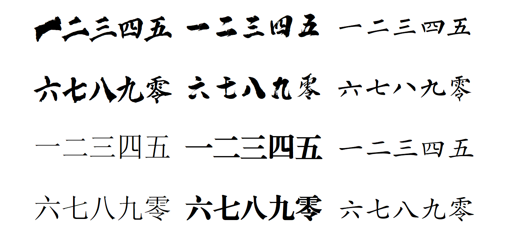

# Font-Generator



Generate Font from png file:

Name png chracter files in their unicode name, such as "0.png" and "零.png"; put them in source directory, and convert it.

```
FontGenerator
├──fonts          font file output directory
├──images         input image store directory
├──potrace        svg generate software
├──readme-asset   assets
└──src            source code
```

Fast Run:

```sh
python src/main.py ..\\images\\source-directory ..\\fonts\\destination-font-name.ttf
```

## Requirements

To run this program, please install these requirements:

```
opencv-python
pillow
numpy
ffpython
```

and these software:

### Potrace

unzip the package in `/potrace/installer`, and copy the executable file into `/potrace/bin`.

### FontForge

I really recommand using this program under Linux enviroment. It is inconvinient to use fontforge as a python extention under Windows. 

**update:**

change the method using fontforge to *ffpython*. 

Install fontforge under Windows, add it's bin fold's path into var *PATH*, and enjoy it!

## Parameters

### Functions: preprocess_image, preprocess_image_otsu

- **`enhance(2.0)`**: Enhances image contrast. `2.0` increases contrast; higher values yield more contrast.
- **`medianBlur(img_np, 5)`**: Reduces image noise. `5` is the kernel size; larger values increase smoothness.
- **`adaptiveThreshold(..., 21, 5)`**:
  - `21`: Kernel size for local thresholding; larger values smooth the result.
  - `5`: Constant subtracted from mean or weighted mean in thresholding.
- **`threshold(..., cv2.THRESH_OTSU)`**: Applies Otsu's method to find an optimal threshold value automatically.

### Function: bitmap_to_svg

- **`--opttolerance 0.2`**: Curve optimization tolerance in Potrace. Lower values retain more bitmap details.
- **`--alphamax 3.5`**: Maximum angle for curve smoothing in Potrace. Higher values result in smoother curves.

## License

Apache 2.0


# 字体生成器


从PNG文件生成字体：

将PNG字符文件以其Unicode名称命名，如 "0.png" 和 "零.png"；将它们放入源目录中，并进行转换。

```
FontGenerator
├──fonts 字体文件输出目录
├──images 输入图片存储目录
├──potrace SVG生成软件
├──readme-asset 资源
└──src 源代码
```

快速运行：

```sh
python Generator/src/generator_main.py experiment_YanZQ_Duobaota/infer_Duobaota_GB2312/0 experiment_YanZQ_Duobaota/my_first_font.ttf
```

其中，第一个参数是推理图片目录，即infer_directory；第二个参数是生成字体的路径及名称，即output_font_name。

## 依赖软件安装

### Potrace

用于生成 svg 文件，Windows 环境下无需安装（已经放置在项目文件夹中）

### FontForge

用于生成字体，目前只支持在 Windows 下安装后将 `D:\ProgramFiles\FontForgeBuilds\bin` 放入 PATH 中的方式来使用 ffpython 库。推荐查阅官方文档以添加其他支持。