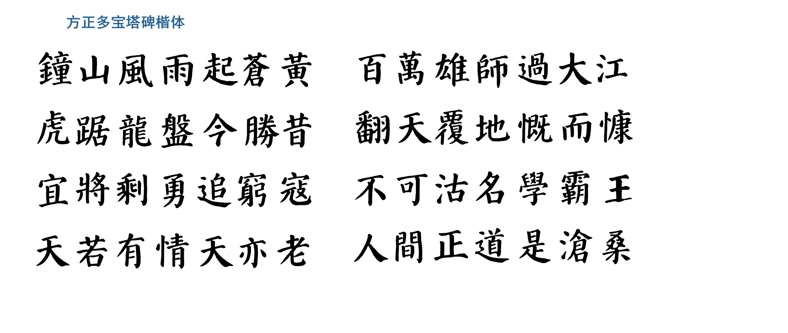
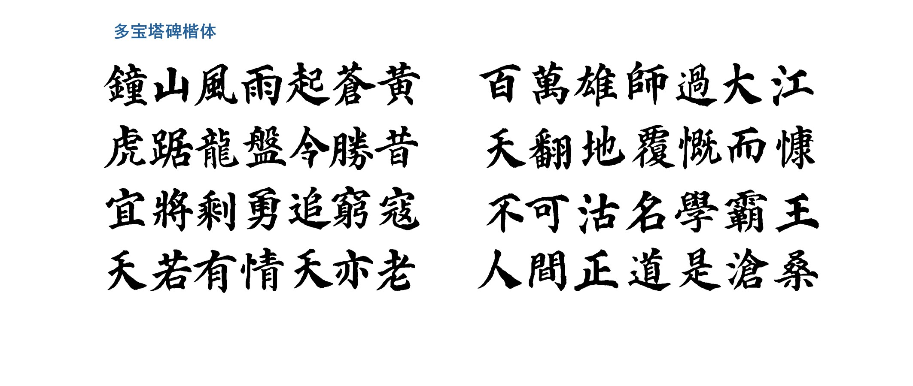
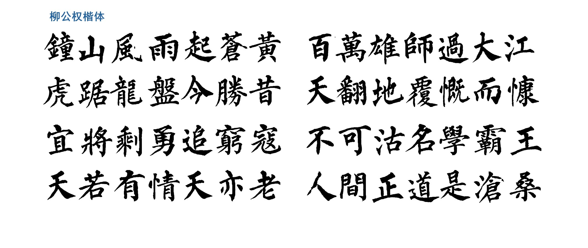
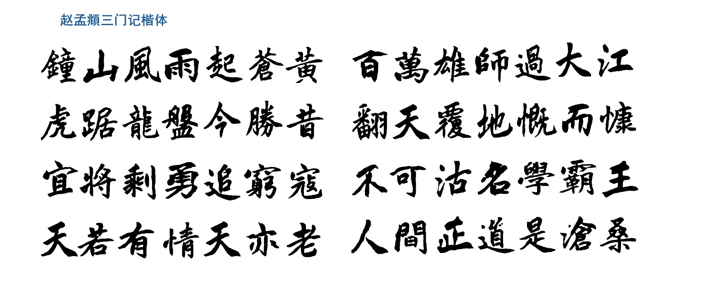
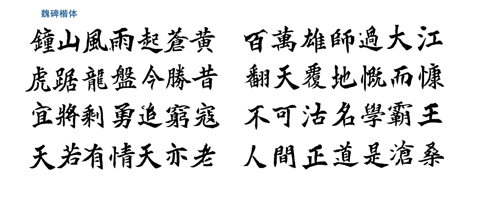

# zi2zi-chain: 实现中国书法字体图片生成和字体制作的一站式开发


**Master Chinese Calligraphy with CGAN: Generating calligraphy font images and creating calligraphy fonts.**

在zi2zi-pytorch（https://github.com/EuphoriaYan/zi2zi-pytorch）的基础上，做了进一步的修复和完善。


**修复部分为**：针对预处理部分的函数弃用、生僻字无法生成、训练和推理部分单卡支持改为多卡并行、以及扩展从本地的txt文件进行字体图片生成等功能。


**完善部分为**：对生成后的字体图片进行了优化，使得生成的图片更加清晰；同时，新增了字体（.ttf或者.otf）制作的功能。


**新楷体——楷书-方正多宝塔碑**

方正多宝塔碑推理效果如下：


**新楷体——楷书-毛笔书法多宝塔碑**

多宝塔碑推理效果如下：


**新楷体——楷书-柳公权**

柳公权-玄秘塔碑推理效果如下：


**新楷体——楷书-赵孟頫三门记**

赵孟頫推理效果如下：


**新楷体——楷书-魏碑**

魏碑推理效果如下：


## 字体图片生成 使用指南

### Requirement

安装的库版本如下:

* Python 3.7
* CUDA 10.2
* cudnn 7.6.5
* pytorch 1.5.1
* pillow 7.1.2
* numpy 1.18.1
* scipy 1.4.1
* imageio 2.8.0

### 预处理会生成二进制文件
为了避免I/O瓶颈，在训练过程中，需要对数据进行预处理，将数据转换为二进制格式并持久化到内存中。

### 第一步：形成配对数据集 font2img.py


#### 模式1 Font2Font

首先从网上下载原字体和目标字体（.ttf或者.otf），然后运行font2img.py（运行以下代码需要将字体文件放置与font2img.py同一目录下），生成配对数据集。

```sh
python font2img.py --src_font=src.ttf
                   --dst_font=trg.otf
                   --charset=CN
                   --sample_count=1000
                   --sample_dir=dir
                   --label=0
                   --filter
                   --shuffle
                   --mode=font2font
```

提供了四种默认字符集：CN（简体中文）、CN_T（繁体中文）、JP（日语）、KR（韩语）。您还可以指定一个单行文件，系统将生成其中字符的图像。


如果您想要使用特定文本(valid.txt)验证网络，请运行以下命令。

```sh
python font2img.py --src_font=src.ttf
                   --dst_font=trg.otf
                   --charset=valid.txt
                   --sample_count=len(infer.txt)
                   --sample_dir=dir
                   --label=0
                   --mode=font2font
```

**valid.txt** 应该是一个只有一行的文件。

#### 模式2 Font2Imgs

当我们不满足于使用网上字体生成目标字体图片，而是拥有或者制作了自己的目标字体图片时，可以使用模式2。


此时原字体图片还是使用ttf生成，而目标字体图片则使用自己制作的图片（如.png格式）。


**注意**：目标字体图片的命名格式为 该图片对应的汉字~下面作者字典对应的值.图片格式的后缀名。


如我们拥有若干张多宝塔碑的图片，图片格式为.gif，则命名为 啊~顏真卿多寶塔體.gif 、 哎~顏真卿多寶塔體.gif、 皑~顏真卿多寶塔體.gif等。


对于特定格式的图片，也可以使用我的data.preprocess.py文件来批量更改图片数据格式。


```python
writer_dict = {
    '智永': 0, ' 隸書-趙之謙': 1, '張即之': 2, '張猛龍碑': 3, '柳公權': 4, '標楷體-手寫': 5, '歐陽詢-九成宮': 6,
    '歐陽詢-皇甫誕': 7, '沈尹默': 8, '美工-崩雲體': 9, '美工-瘦顏體': 10, '虞世南': 11, '行書-傅山': 12, '行書-王壯為': 13,
    '行書-王鐸': 14, '行書-米芾': 15, '行書-趙孟頫': 16, '行書-鄭板橋': 17, '行書-集字聖教序': 18, '褚遂良': 19, '趙之謙': 20,
    '趙孟頫三門記體': 21, '隸書-伊秉綬': 22, '隸書-何紹基': 23, '隸書-鄧石如': 24, '隸書-金農': 25,  '顏真卿-顏勤禮碑': 26,
    '顏真卿多寶塔體': 27, '魏碑': 28
}
```

```sh
python font2img.py --src_font=src.ttf
                   --dst_imgs=target_path
                   --sample_count=1000
                   --sample_dir=dir
                   --mode=font2imgs
```

#### 模式3 Imgs2Imgs

当原图片和目标图片都不需要从现有的字体生成时，可以使用模式3。此时src_imgs和dst_imgs都需要指定为图片的路径。


操作比较简单，只需要对原图片和目标图片进行一个拼接。但要**注意**的是，原图片文件夹和目标图片文件夹的图片必须是一一对应的、顺序一致的。

```sh
python font2img.py --src_imgs=source_path
                   --dst_imgs=target_path
                   --sample_count=1000
                   --sample_dir=dir
                   --mode=imgs2imgs
```

### 第二步：配对数据集的预处理-转换为二进制文件 package.py

在获取所有图像后，运行package.py将图像及其对应标签转换为二进制格式。


这里的--dir对应的路径即是第一步生成的配对数据集的文件夹。其中，split_ratio范围在[0,1]之间。

```sh
python package.py --dir=image_directories
                  --save_dir=binary_save_directory
                  --split_ratio=0.2
```

运行后，您将在 **--save_dir** 指定的文件夹下找到两个对象：**train.obj** 和 **val.obj**，分别用于训练和验证。


如果您想要使用特定文本进行推断/验证网络，请运行以下命令。

```sh
python package.py --dir=image_directories
                  --save_dir=binary_save_directory
                  --split_ratio=0
```

请注意，当split_ratio=0，val.obj是一个空文件。所以您可以通过某种方式将train.obj重命名为infer.obj或val.obj。

#### Experiment文件夹的布局
```sh
experiment/
└── data
    ├── train.obj
    └── val.obj
```
在项目的根目录下创建一个**experiment**目录，并在其中创建一个data目录来放置这两个二进制文件。

### 第三步：训练网络 train.py

开始训练请运行以下命令：


参数含义解释如下：

- `--experiment_dir=experiment`：指定实验的目录，用于存储训练过程中生成的样本、日志和检查点等文件。
- `--gpu_ids=cuda:0`：指定要使用的GPU编号，在这里是使用cuda编号为0的GPU进行训练。
- `--batch_size=32`：指定每个训练批次的样本数量为32。
- `--epoch=100`：指定训练的总轮数为100轮。
- `--sample_steps=200`：指定每隔多少步（iterations）生成一次样本。
- `--checkpoint_steps=500`：指定每隔多少步（iterations）保存一次模型检查点。
- `--schedule=10`：指定学习率将在多少个epochs之间减半。

#### 单卡运行
```sh
python train.py --experiment_dir=experiment 
				--gpu_ids=cuda:0 
                --batch_size=32 
                --epoch=100
                --sample_steps=200 
                --checkpoint_steps=500
```
**schedule** 在这里表示学习率将在多少个epochs之间减半。如果不存在，训练命令会在**experiment_dir**下创建**sample,logs,checkpoint**目录，您可以在其中查看和管理训练的进度。

在训练过程中，您会在checkpoint目录中找到两个或多个checkpoint文件**N_net_G.pth**和**N_net_D.pth**，其中N表示步数。

**警告**：如果您的**--checkpoint_steps**较小，您将在checkpoint路径中找到大量的checkpoint文件，并且您的磁盘空间将被填满无用的checkpoint文件。您可以删除无用的checkpoint文件以节省磁盘空间。

#### 多卡并行
```sh
python train.py --experiment_dir=experiment 
				--gpu_ids=cuda:0 cuda:1
                --batch_size=32 
                --epoch=100
                --sample_steps=200 
                --checkpoint_steps=500
```

### 第四步：模型推理——生成字体图片 infer.py

训练结束后，您可以运行以下命令来推理测试数据，生成对应的字体图片。

#### 使用val.obj进行推理

以下是对每个参数含义的解释：

- `--experiment_dir experiment`：指定实验的目录，即存储训练过程中生成的样本、日志和检查点等文件的目录。
- `--batch_size 32`：指定每个推理批次的样本数量为32。
- `--gpu_ids cuda:0`：指定要使用的GPU编号，在这里是使用cuda编号为0的GPU进行推理。
- `--resume {the saved model you select}`：指定要恢复的模型文件，用于进行推理。
- `--obj_pth obj_path`：指定二进制文件的路径，用于推理时加载相关的对象文件。
- `--infer_dir`：指定推理结果保存的文件夹。


```sh
python infer.py --experiment_dir experiment
                --batch_size 32
                --gpu_ids cuda:0 
                --resume {the saved model you select}
                --obj_pth obj_path
                --infer_dir infer_obj
```

例如，如果您想要使用经过100步训练的模型**100_net_G.pth**和**100_net_D.pth**，您应该使用**--resume=100**。

#### 使用一行文字进行推理（适用数据不多的情况）


```sh
python infer.py --experiment_dir experiment
                --gpu_ids cuda:0
                --batch_size 32
                --resume {the saved model you select}
                --from_txt
                --src_font {your model\'s source font file}
                --src_txt "宜將剩勇追窮寇不可沽名學霸王天若有情天亦老人間正道是滄桑"
                --infer_dir infer_sentence
```
**src_txt** 是你想要推理的文字。

#### 使用本地的txt文件进行推理（适用数据较多的情况）

```sh
python infer.py --experiment_dir experiment
                --gpu_ids cuda:0
                --batch_size 32
                --resume {the saved model you select}
                --from_txt2
                --src_font {your model\'s source font file}
                --src_txt_file GB2312.txt
                --infer_dir infer_GB2312
```

**src_txt_file** 是你想要推理的本地txt文件路径。 


## 字体制作 使用指南


## Pre-trained model
本项目提供训练好的模型，有方正多宝塔碑、多宝塔碑、柳公权楷书、魏碑、赵孟頫三门记、何绍基隶书、金农隶书供大家下载使用。

## Acknowledgements
Code derived and rehashed from:

* [zi2zi-pytorch](https://github.com/EuphoriaYan/zi2zi-pytorch) by [EuphoriaYan](https://github.com/EuphoriaYan)
* [pix2pix-tensorflow](https://github.com/yenchenlin/pix2pix-tensorflow) by [yenchenlin](https://github.com/yenchenlin)
* [Domain Transfer Network](https://github.com/yunjey/domain-transfer-network) by [yunjey](https://github.com/yunjey)
* [ac-gan](https://github.com/buriburisuri/ac-gan) by [buriburisuri](https://github.com/buriburisuri)
* [dc-gan](https://github.com/carpedm20/DCGAN-tensorflow) by [carpedm20](https://github.com/carpedm20)
* [origianl pix2pix torch code](https://github.com/phillipi/pix2pix) by [phillipi](https://github.com/phillipi)
* [zi2zi](https://github.com/kaonashi-tyc/zi2zi) by [kaonashi-tyc](https://github.com/kaonashi-tyc)
* [zi2zi-pytorch](https://github.com/xuan-li/zi2zi-pytorch) by [xuan-li](https://github.com/xuan-li)
* [Font2Font](https://github.com/jasonlo0509/Font2Font) by [jasonlo0509](https://github.com/jasonlo0509)

## License
Apache 2.0

